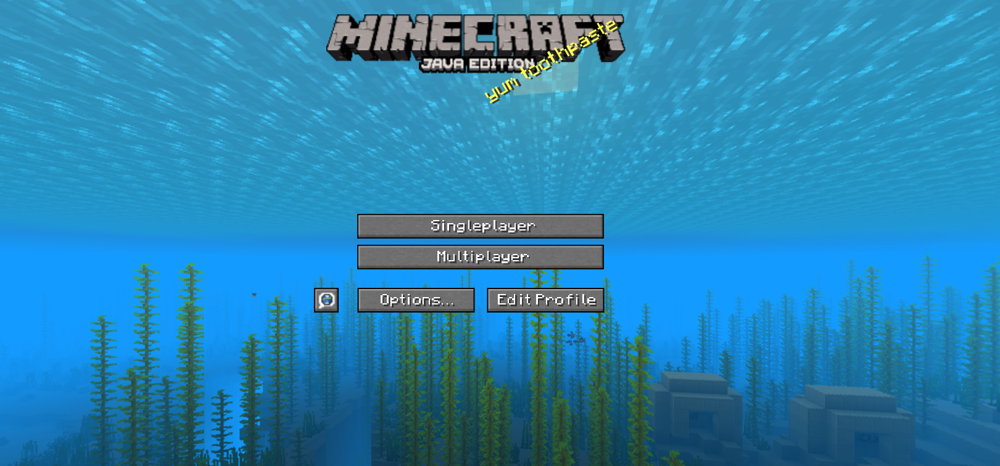

# Play Minecraft 1.13 directly in your web browser

### ⚠ ATTENTION DMCA PEOPLE TRYING TO HUNT ME DOWN: This website is a *reverse engineered version of Minecraft 1.13* not an actual copy ⚠

# UNDER CONSTRUCTION

# Eaglercraft Reverse 1.13

## Created by AverageToothpasteEnjoyer

# What is Eaglercraft Reverse?

### Eaglercraft Reverse is a project dedicated to reverse engineering Minecraft versions with Javascript. This project was created because versions **1.13+** would be a living hell with preformance when running in a web browser, and Minecraft isn't really built to run in a web browser.

# Progress

## ***23% done*** (I just came up with this in my head)

## Release date prediction: ***May 25, 2025***

## Latest Update: **working on skins and menus**

## When it started: **Early September 2024** (I was on vacation for a while)

# Devs *[1 dev]*

## AverageToothpasteEnjoyer 👑 **(Owner/Developer)**
### <li>Likes drinking water out of the sink</li>
### <li>Likes coding</li>
### <li>Working on Eaglercraft 1.13</li>

<i>yeeeeeeeee :></i>